# StockSonar — Architecture & Technical Documentation

## Overview

StockSonar is a production-grade MCP (Model Context Protocol) server for Indian financial intelligence. It wraps free Indian financial APIs into structured MCP primitives (tools, resources, prompts) with OAuth 2.1 authentication, tiered authorization, Redis caching, and cross-source reasoning.

**Use case:** PS2 — Portfolio Risk & Alert Monitor.

---

## System Architecture

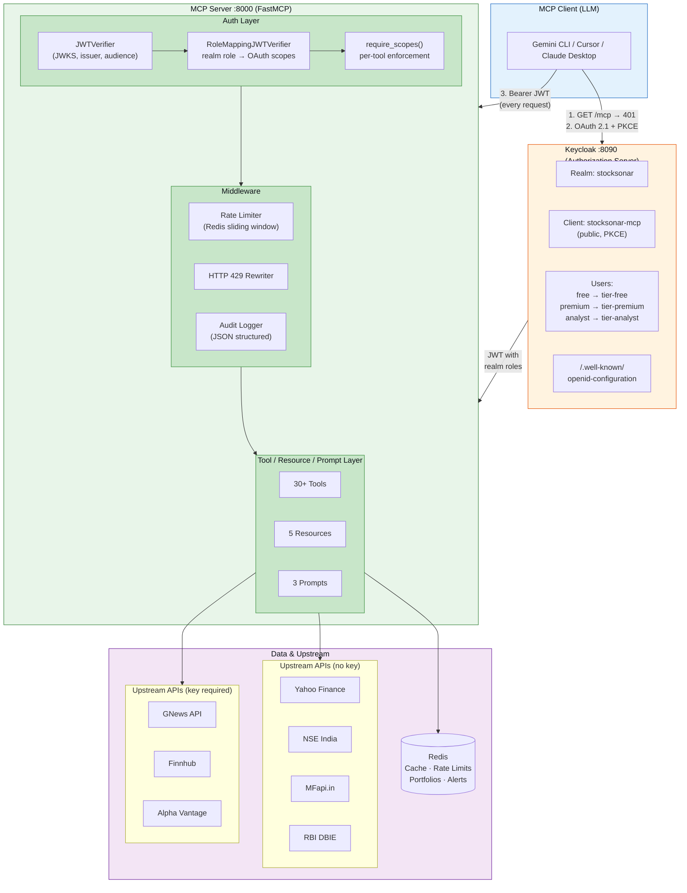

---

## OAuth 2.1 Authentication Flow

### The full flow step-by-step

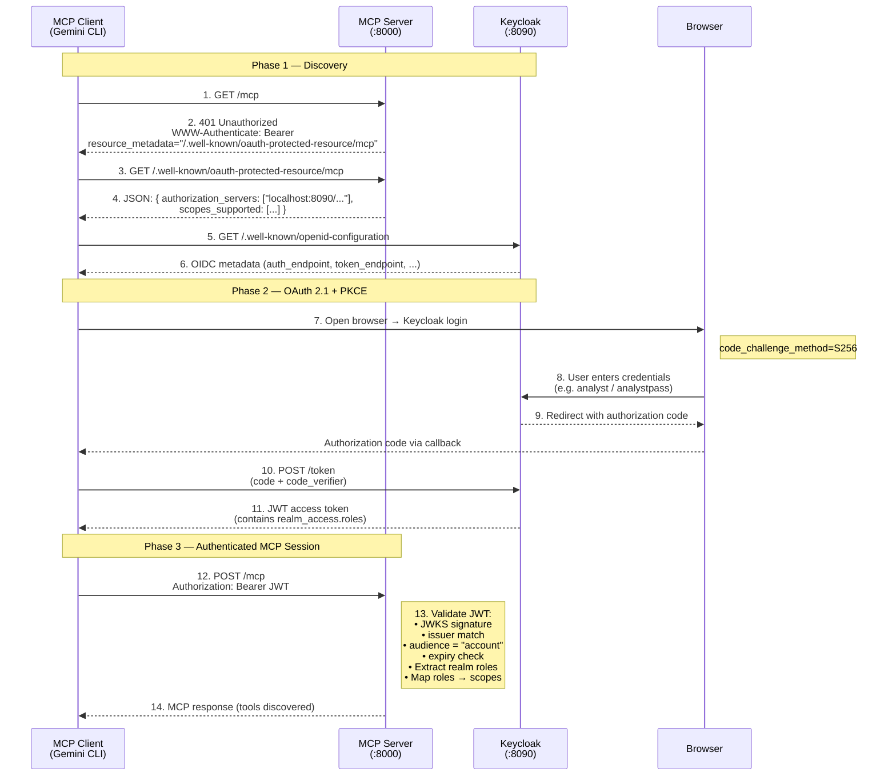

### Key standards implemented

| Standard | Implementation |
|----------|---------------|
| **OAuth 2.1 + PKCE** | Keycloak public client `stocksonar-mcp`, `code_challenge_method=S256` |
| **RFC 9728** (Protected Resource Metadata) | `/.well-known/oauth-protected-resource/mcp` endpoint |
| **RFC 8707** (Resource Indicators) | JWT `aud` claim bound to `account` |
| **Bearer Token (RFC 6750)** | All requests validated via `Authorization: Bearer <JWT>` |
| **401 with Discovery** | `WWW-Authenticate` header includes `resource_metadata` URL |

---

## Keycloak Configuration

### Realm: `stocksonar`

Defined in `keycloak/stocksonar-realm.json`, auto-imported on first boot via `--import-realm`.

```json
{
  "realm": "stocksonar",
  "accessTokenLifespan": 28800,
  "sslRequired": "none"
}
```

### Client: `stocksonar-mcp`

```json
{
  "clientId": "stocksonar-mcp",
  "publicClient": true,
  "directAccessGrantsEnabled": true,
  "standardFlowEnabled": true,
  "redirectUris": ["*"],
  "protocolMappers": [{
    "name": "access-token-audience-account",
    "protocolMapper": "oidc-audience-mapper",
    "config": {
      "included.client.audience": "account",
      "access.token.claim": "true"
    }
  }]
}
```

- **Public client** — no client secret (PKCE required)
- **Direct access grants** — enabled for password-grant test scripts
- **Audience mapper** — ensures `aud: "account"` in every access token (server validates this)

### Users and Realm Roles

| Username | Password | Realm Role | Mapped Scopes |
|----------|----------|------------|---------------|
| `free` | `freepass` | `tier-free` | `market:read`, `mf:read`, `news:read`, `portfolio:read`, `portfolio:write`, `watchlist:read`, `watchlist:write` |
| `premium` | `premiumpass` | `tier-premium` | All Free + `fundamentals:read`, `technicals:read`, `macro:read`, `portfolio:risk`, `news:sentiment` |
| `analyst` | `analystpass` | `tier-analyst` | All Premium + `filings:read`, `filings:deep`, `macro:historical`, `research:generate` |

### Role-to-Scope Mapping

Keycloak issues JWTs with `realm_access.roles`. The MCP server's `RoleMappingJWTVerifier` extracts roles from the JWT claims and maps them to OAuth-style scopes:

```mermaid
graph LR
    subgraph JWT["JWT Claims"]
        Roles["realm_access.roles:<br/>[&quot;tier-analyst&quot;]"]
    end

    subgraph Server["MCP Server"]
        Verifier["RoleMappingJWTVerifier"]
        Mapper["scopes_for_realm_roles()"]
        Verifier --> Mapper
    end

    subgraph Scopes["Effective Scopes (16)"]
        S1["market:read"]
        S2["portfolio:read / :write / :risk"]
        S3["fundamentals:read"]
        S4["technicals:read"]
        S5["macro:read / :historical"]
        S6["news:read / :sentiment"]
        S7["filings:read / :deep"]
        S8["research:generate"]
        S9["mf:read, watchlist:*"]
    end

    Roles --> Verifier
    Mapper --> Scopes

    style JWT fill:#fff3e0,stroke:#e65100,color:#0d1117
    style Server fill:#e8f5e9,stroke:#2e7d32,color:#0d1117
    style Scopes fill:#e3f2fd,stroke:#1565c0,color:#0d1117
```

Each tool is registered with `@mcp.tool(auth=require_scopes("scope:name"))`. FastMCP checks the token's scopes before execution.

---

## Authorization: Tiered Access Control

### Scope Design (16 scopes)

| Scope | Purpose | Free | Premium | Analyst |
|-------|---------|:----:|:-------:|:-------:|
| `market:read` | Quotes, price history, indices, movers | Y | Y | Y |
| `mf:read` | Mutual fund NAV, search, comparison | Y | Y | Y |
| `news:read` | Company/market news articles | Y | Y | Y |
| `portfolio:read` | Read portfolio holdings | Y | Y | Y |
| `portfolio:write` | Add/remove portfolio holdings | Y | Y | Y |
| `watchlist:read` | Read watchlist | Y | Y | Y |
| `watchlist:write` | Modify watchlist | Y | Y | Y |
| `fundamentals:read` | Financial statements, ratios | - | Y | Y |
| `technicals:read` | Technical indicators, options | - | Y | Y |
| `macro:read` | RBI rates, inflation (current) | - | Y | Y |
| `portfolio:risk` | Risk tools (health check, concentration) | - | Y | Y |
| `news:sentiment` | Sentiment analysis | - | Y | Y |
| `filings:read` | List company filings | - | - | Y |
| `filings:deep` | Retrieve full filing documents | - | - | Y |
| `macro:historical` | Full historical macro time series | - | - | Y |
| `research:generate` | Cross-source reasoning tools | - | - | Y |

### PS2 Tool-to-Tier Mapping

| Tool | Scope Required | Free | Premium | Analyst |
|------|---------------|:----:|:-------:|:-------:|
| `add_to_portfolio` | `portfolio:write` + `portfolio:read` | Y | Y | Y |
| `remove_from_portfolio` | `portfolio:write` + `portfolio:read` | Y | Y | Y |
| `get_portfolio_summary` | `portfolio:read` | Y | Y | Y |
| `portfolio_health_check` | `portfolio:risk` | - | Y | Y |
| `check_concentration_risk` | `portfolio:risk` | - | Y | Y |
| `check_mf_overlap` | `portfolio:risk` | - | Y | Y |
| `check_macro_sensitivity` | `portfolio:risk` | - | Y | Y |
| `detect_sentiment_shift` | `portfolio:risk` | - | Y | Y |
| `portfolio_risk_report` | `research:generate` | - | - | Y |
| `what_if_analysis` | `research:generate` | - | - | Y |
| `cross_reference_signals` | `research:generate` | - | - | Y |

### Enforcement Points

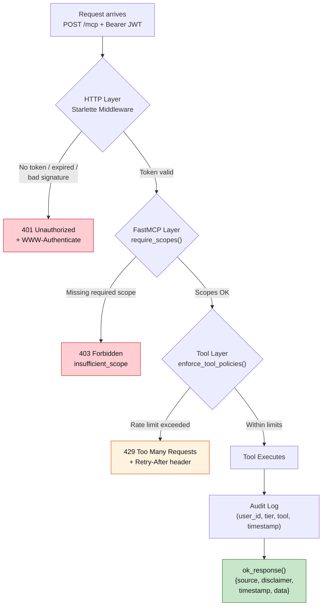

---

## Rate Limiting

### Mechanism

Redis sorted set per user (`ratelimit:{user_sub}`), scored by Unix timestamp. 1-hour sliding window.

| Tier | Limit | Redis Key Example |
|------|-------|-------------------|
| Free | 30 req/hour | `ratelimit:77aa51f3-...` |
| Premium | 150 req/hour | `ratelimit:88bb62g4-...` |
| Analyst | 500 req/hour | `ratelimit:99cc73h5-...` |

### How 429 is returned

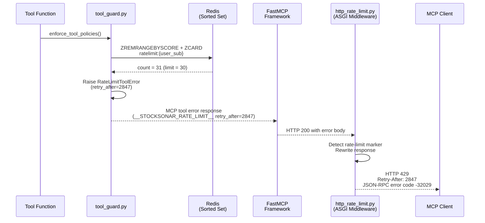

---

## Upstream API Integration

### Data Sources (6 integrated)

| Source | Module | Data Type | Auth | TTL |
|--------|--------|-----------|------|-----|
| **Yahoo Finance** (`yfinance`) | `upstream/yfinance_client.py` | Market data, quotes, fundamentals | No key | 60s (quotes) |
| **NSE India** (`jugaad-data`) | `upstream/nse.py` | Indices, top movers, equity quotes | No key | 60s |
| **MFapi.in** | `upstream/mfapi.py` | Mutual fund NAV, scheme search | No key | 1h |
| **GNews** | `upstream/news.py` | News articles, sentiment | API key | 30min |
| **RBI DBIE** (`jugaad-data`) | `upstream/macro.py` | Repo rate, CPI, forex, GDP | No key | 1h |
| **BSE India** | `upstream/filings_upstream.py` | Corporate filings | No key | 24h |

### API Key Isolation

- All upstream API keys are stored in server-side `.env` / container environment variables
- Keys are **never** exposed in tool responses or to MCP clients
- The `Settings` class loads them via `pydantic-settings` from environment
- `.env` is gitignored; `.env.example` documents required keys with sign-up links

### Upstream Quota Awareness

- **GNews:** Server tracks daily call count via `gnews_quota.py` (Redis counter, default cap: 90/day to stay under 100/day free tier)
- **NSE India:** Rate-limited by source; wrapped in `asyncio.to_thread` to avoid blocking
- **yfinance:** Unofficial, no hard quota; `get_quote()` wrapped in try/except for invalid tickers

### Caching Strategy

| Data Type | TTL | Storage |
|-----------|-----|---------|
| Stock quotes | 60 seconds | Redis |
| News articles | 30 minutes | Redis |
| Financial statements | 24 hours | Redis |
| Mutual fund NAV | 1 hour | Redis |
| Index data | 60 seconds | Redis |
| Macro snapshot | 1 hour | Process-local + Redis |
| Filings metadata | 24 hours | Redis |

All caching uses `RedisCache` with type-based keys (`{data_type}:{identifier}`) and configurable TTLs in `Settings`.

---

## MCP Primitive Design Decisions

### Why Tools vs Resources vs Prompts?

| Primitive | When to use | StockSonar examples |
|-----------|-------------|---------------------|
| **Tool** | Active computation, API calls, side effects | `get_stock_quote`, `add_to_portfolio`, `portfolio_risk_report` |
| **Resource** | Read-only state snapshots, subscriptions | `portfolio://holdings`, `market://overview`, `macro://snapshot` |
| **Prompt** | LLM instruction templates that orchestrate multiple tools | `morning_risk_brief`, `rebalance_suggestions` |

**Tools** are the primary interface — they take parameters, call upstream APIs, apply business logic, and return structured JSON. Every tool output includes `{source, disclaimer, timestamp, data}`.

**Resources** expose persisted state (portfolio holdings in Redis, computed risk scores, cached market snapshots). They support subscriptions — the server fires `notifications/resources/updated` when underlying data changes (e.g., after `portfolio_health_check` updates alerts).

**Prompts** are meta-instructions for the LLM. They don't call APIs directly — they tell the LLM *which tools to call and how to synthesize results*. This keeps the server as a data provider (structured JSON) while the LLM handles narrative.

### Tool Response Format

Every tool returns:

```json
{
  "source": "Yahoo Finance + NSE India (jugaad-data)",
  "disclaimer": "Information is for informational purposes only and is not financial advice.",
  "timestamp": "2026-04-04T10:21:52.123456+00:00",
  "data": { ... }
}
```

- `source` — cites exactly which upstream API(s) provided the data
- `disclaimer` — configurable, always present (not financial advice)
- `timestamp` — UTC ISO 8601
- `data` — structured payload (never free-form text)

---

## Cross-Source Reasoning

### `portfolio_risk_report` (the PS2 differentiator)

Combines data from 5+ sources in a single tool call:

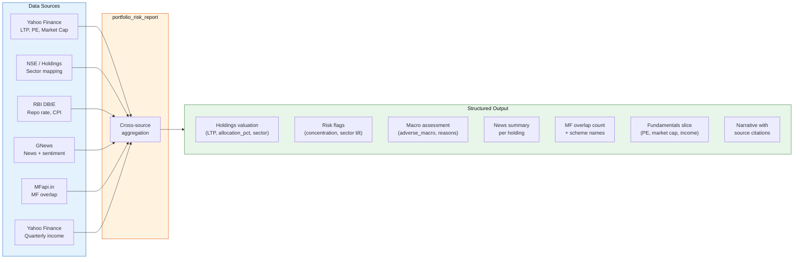

### `what_if_analysis`

Simulates RBI rate change scenarios:

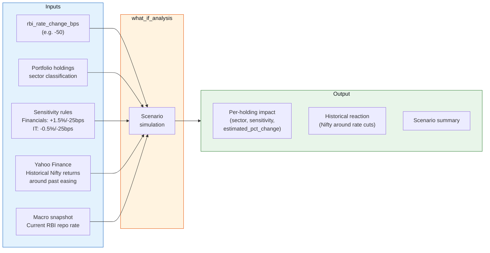

### `cross_reference_signals`

Explicit confirm/contradict analysis:

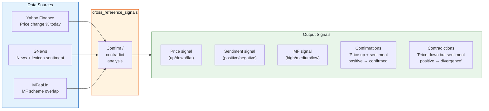

---

## Resource Subscriptions (PS2 Key Differentiator)

### How it works

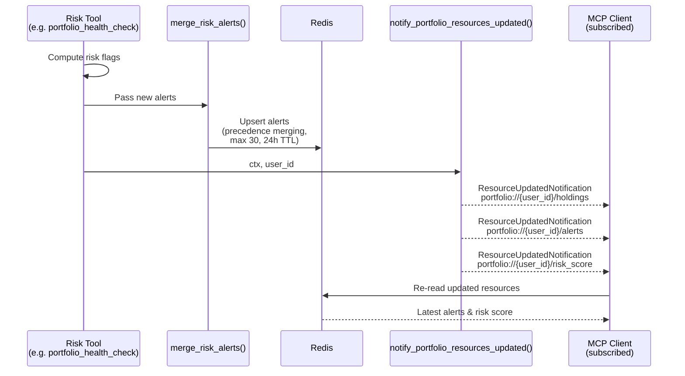

Similarly, `refresh_market_overview` invalidates the market cache and fires `notify_market_overview_updated` for `market://overview` subscribers.

### Alert Merging

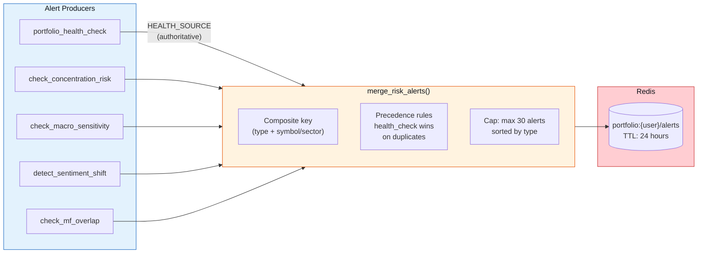

- Each alert has a composite key (type + symbol/sector)
- Alerts from `portfolio_health_check` are authoritative (won't be overwritten by other tools)
- Maximum 30 alerts retained, sorted by type
- Alerts expire after 24 hours (Redis TTL)

---

## Audit Logging

Every tool invocation is logged as a structured JSON line:

```json
{
  "event": "tool_call",
  "tool_name": "portfolio_health_check",
  "user_id": "77aa51f3-c038-4157-8427-bff97e8e0d12",
  "tier": "analyst",
  "success": true,
  "detail": {},
  "timestamp": "2026-04-04T10:21:52.123456"
}
```

Failed calls (rate limit exceeded) include `detail.error` and `detail.retry_after`.

---

## Docker Compose Deployment

### Services & Network Topology

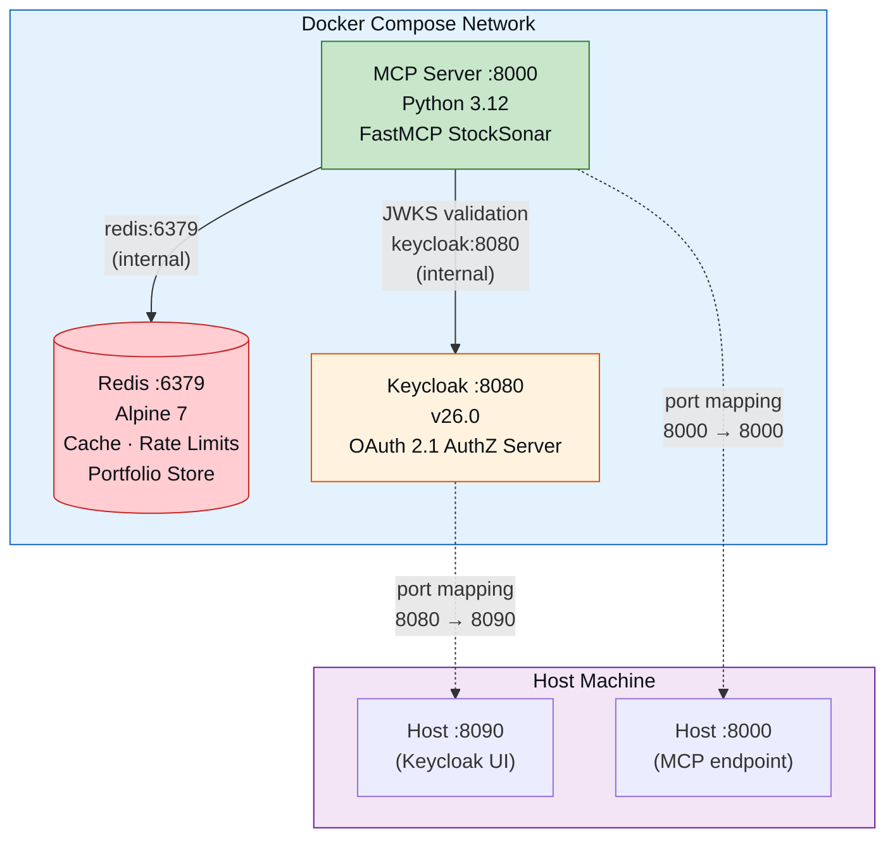

- Redis is **internal only** — not exposed to the host
- Keycloak maps 8080 → host 8090 (avoids port conflicts)
- MCP server connects to Redis at `redis:6379` and validates JWTs against Keycloak's JWKS at `keycloak:8080`
- MCP server's issuer config uses `localhost:8090` (what the client sees) while JWKS URI uses `keycloak:8080` (internal, faster)

### One-command start

```bash
docker compose up -d --build
```

---

## Project Structure

```
StockSonar/
├── docker-compose.yml              # Redis + Keycloak + MCP server
├── Dockerfile                      # Python 3.12 slim image
├── requirements.txt                # Python dependencies
├── pyproject.toml                  # Project metadata, pytest config
├── .env.example                    # Environment variable documentation
├── .env.llm                        # Static-token auth mode for local LLM dev
├── .gemini/settings.json           # Gemini CLI MCP config
├── .cursor/mcp.json                # Cursor MCP config
├── .mcp.json                       # Claude Code MCP config
├── keycloak/
│   └── stocksonar-realm.json       # Realm, users, roles, client config
├── src/stocksonar/
│   ├── server.py                   # FastMCP entrypoint, lifespan, health route
│   ├── config.py                   # pydantic-settings (env vars → Settings)
│   ├── auth/
│   │   ├── provider.py             # Build RemoteAuthProvider (Keycloak or static)
│   │   ├── role_verifier.py        # JWT realm roles → OAuth scopes
│   │   └── scopes.py              # Scope definitions, tier mapping
│   ├── cache/
│   │   └── redis_cache.py          # TTL-based Redis cache (get/set/delete JSON)
│   ├── middleware/
│   │   ├── tool_guard.py           # Rate limit check + audit per tool call
│   │   ├── rate_limiter.py         # Redis sorted-set sliding window
│   │   ├── http_rate_limit.py      # ASGI middleware: rewrite to HTTP 429
│   │   └── audit.py               # Structured JSON audit logging
│   ├── services/
│   │   ├── portfolio.py            # PortfolioStore (Redis CRUD for holdings/alerts)
│   │   ├── portfolio_alerts.py     # Alert normalization and precedence merging
│   │   ├── market_overview.py      # Cached market overview builder
│   │   └── watchlist.py            # WatchlistStore (Redis)
│   ├── tools/
│   │   ├── register.py             # Registers all tools, resources, prompts
│   │   ├── market.py               # get_stock_quote, get_price_history, get_index_data, ...
│   │   ├── portfolio.py            # add/remove/summary/health_check
│   │   ├── portfolio_metrics.py    # Shared valuation helpers
│   │   ├── risk.py                 # concentration, MF overlap, macro, sentiment
│   │   ├── cross_source.py         # portfolio_risk_report, what_if, cross_reference
│   │   ├── news_tools.py           # company_news, market_news, sentiment
│   │   ├── fundamentals_tools.py   # financial statements, ratios, shareholding
│   │   ├── technicals_tools.py     # indicators, option chains
│   │   ├── macro_tools.py          # macro snapshot, historical series
│   │   ├── mutual_funds.py         # search, NAV, compare
│   │   ├── filings_tools.py        # list filings, get document
│   │   ├── watchlist_tools.py      # add/remove/list watchlist
│   │   ├── aliases_ps2.py          # Thin aliases (get_rbi_rates, get_inflation_data, ...)
│   │   ├── prompts_ps2.py          # morning_risk_brief, rebalance, earnings_exposure
│   │   ├── resources_portfolio.py  # portfolio:// resources
│   │   ├── resources_market_macro.py # market:// + macro:// resources
│   │   └── resources_watchlist.py  # watchlist:// resources
│   ├── upstream/
│   │   ├── yfinance_client.py      # Yahoo Finance wrapper
│   │   ├── nse.py                  # NSE India (jugaad-data)
│   │   ├── news.py                 # GNews API client + sentiment lexicon
│   │   ├── macro.py                # RBI macro data
│   │   ├── macro_historical.py     # Historical macro time series
│   │   ├── mfapi.py                # MFapi.in mutual fund client
│   │   ├── fundamentals_data.py    # Company fundamentals (yfinance)
│   │   ├── filings_upstream.py     # BSE filings
│   │   ├── technicals_data.py      # Technical indicators
│   │   └── gnews_quota.py          # GNews daily quota tracking
│   ├── util/
│   │   ├── response.py             # ok_response() — standard output format
│   │   ├── notifications.py        # Resource update notifications
│   │   └── pagination.py           # Cursor-based pagination helper
│   └── exceptions.py              # RateLimitToolError, custom exceptions
├── tests/
│   ├── ps2/                        # PS2-specific unit tests
│   └── integration/                # PKCE + live MCP integration tests
├── scripts/
│   ├── ps2_interactive.py          # Interactive menu-driven PS2 shell
│   ├── run_judge_demo.py           # Automated judge demo script
│   ├── call_all_mcp_tools.py       # Full tool sweep
│   ├── check_stack_health.py       # Stack readiness probe
│   ├── run_integration_tests.py    # pytest wrapper with logging
│   └── e2e_common.py              # Shared E2E utilities
├── docs/
│   ├── DEMO_GUIDE.md              # Step-by-step demo script for judges
│   ├── ARCHITECTURE.md            # This file
│   ├── gemini_test_prompts.md     # Copy-paste prompts for Gemini CLI testing
│   └── problem_statement.md       # PS2 requirements breakdown
└── logs/                          # Auto-generated demo/test logs (gitignored)
```

---

## API Reference

### Tools (30+)

#### Portfolio Management (all tiers)

| Tool | Parameters | Scope | Description |
|------|-----------|-------|-------------|
| `add_to_portfolio` | `symbol`, `quantity`, `avg_buy_price` | `portfolio:write` + `portfolio:read` | Add/update holding (validates symbol via Yahoo Finance) |
| `remove_from_portfolio` | `symbol` | `portfolio:write` + `portfolio:read` | Remove a holding |
| `get_portfolio_summary` | — | `portfolio:read` | Value, P&L, allocation with live quotes |

#### PS2 Risk Detection (premium+)

| Tool | Parameters | Scope | Description |
|------|-----------|-------|-------------|
| `portfolio_health_check` | — | `portfolio:risk` | Concentration + sector exposure snapshot |
| `check_concentration_risk` | — | `portfolio:risk` | Flag single stock >20% or sector >40% |
| `check_mf_overlap` | — | `portfolio:risk` | Check holdings overlap with popular MF schemes |
| `check_macro_sensitivity` | — | `portfolio:risk` | Flag rate/forex sensitive holdings + macro conditions |
| `detect_sentiment_shift` | — | `portfolio:risk` | 7-day vs 30-day news sentiment comparison |

#### Cross-Source Reasoning (analyst only)

| Tool | Parameters | Scope | Description |
|------|-----------|-------|-------------|
| `portfolio_risk_report` | — | `research:generate` | Full cross-source risk narrative (5+ APIs) |
| `what_if_analysis` | `rbi_rate_change_bps` | `research:generate` | Rate change scenario simulation |
| `cross_reference_signals` | `symbol` | `research:generate` | Confirm/contradict across price, news, MF |

#### Market Data (free+)

| Tool | Parameters | Scope | Description |
|------|-----------|-------|-------------|
| `get_stock_quote` | `ticker` | `market:read` | Live quote (LTP, change, volume, P/E, 52W) |
| `get_price_history` | `ticker`, `start`, `end`, `interval`, `cursor`, `limit` | `market:read` | Historical OHLCV (paginated) |
| `get_index_data` | `index_name` | `market:read` | Nifty 50, Bank Nifty, sectoral indices |
| `get_top_gainers_losers` | `exchange` | `market:read` | Today's top movers |
| `refresh_market_overview` | — | `portfolio:risk` | Invalidate market cache + notify subscribers |

*(Additional tools: `get_technical_indicators`, `get_options_chain`, `get_financial_statements`, `get_shareholding_structure`, `get_corporate_actions`, `get_earnings_calendar`, `search_mutual_funds`, `get_fund_nav`, `compare_mutual_funds`, `get_company_news`, `get_market_news`, `analyze_news_sentiment`, `get_macro_snapshot_tool`, `get_macro_historical_series`, `list_company_filings`, `get_filing_document`, `add_watchlist_symbol`, `remove_watchlist_symbol`, `list_watchlist`, `get_rbi_rates`, `get_inflation_data`, `get_news_sentiment`)*

### Resources (5)

| URI Pattern | Scope | Description |
|-------------|-------|-------------|
| `portfolio://{user_id}/holdings` | `portfolio:risk` | User's current portfolio |
| `portfolio://{user_id}/alerts` | `portfolio:risk` | Active risk alerts |
| `portfolio://{user_id}/risk_score` | `portfolio:risk` | Overall risk score |
| `market://overview` | `macro:read` | Nifty, Bank Nifty, top movers |
| `macro://snapshot` | `macro:read` | RBI rates, CPI, macro indicators |

### Prompts (3)

| Name | Parameters | Scope | Description |
|------|-----------|-------|-------------|
| `morning_risk_brief` | — | `portfolio:read` + `news:read` + `macro:read` | Daily portfolio risk briefing |
| `rebalance_suggestions` | `focus_sector` (optional) | `portfolio:risk` | Concentration-based rebalancing ideas |
| `earnings_exposure` | — | `portfolio:read` + `fundamentals:read` | Map holdings to upcoming earnings |

---

## Security Summary

| Concern | Implementation |
|---------|---------------|
| Token validation | JWKS signature + issuer + audience + expiry |
| Scope enforcement | `require_scopes()` on every tool/resource/prompt |
| API key isolation | Server `.env` only, never in responses |
| Rate limiting | Per-user Redis sliding window, HTTP 429 + Retry-After |
| Audit trail | JSON-structured log per tool invocation |
| PKCE | Mandatory for all MCP clients (public client) |
| Upstream failures | Graceful degradation (return cached data or clear error) |
| Input validation | Symbol validation via Yahoo Finance before portfolio add |
